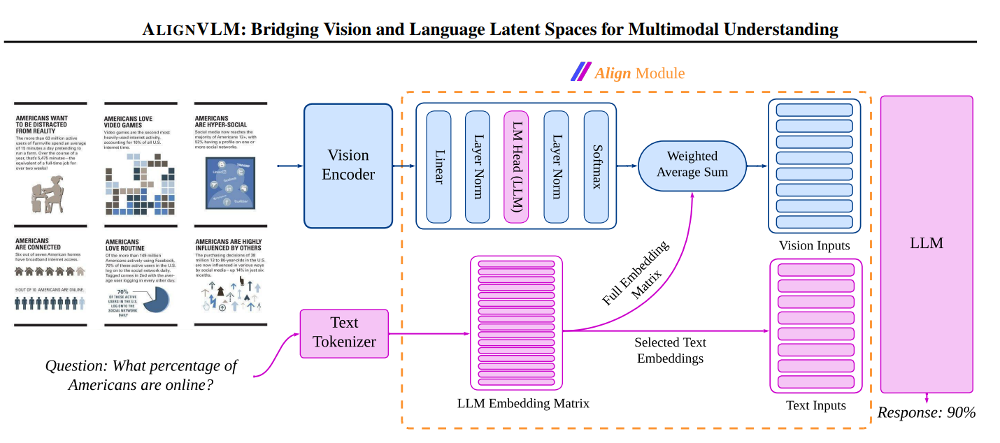
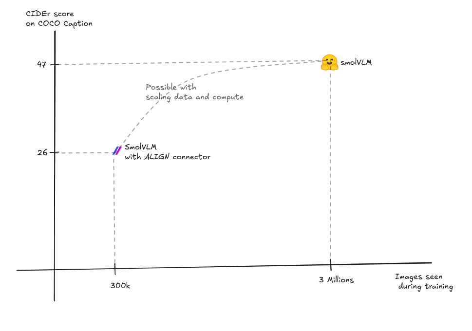

# AlignVLM
This repository contains the implementation of  [AlignVLM](https://arxiv.org/abs/2502.01341) paper, which proposes a novel method for vision language alignment



---

# Disclaimer
This is not the official implementation of AlignVLM paper. There is a slight difference in the method suggested in AlignVLM 
paper and this implementation. The difference is as follows: \\

Align module from the paper (Section 3.1) can be written as follows, where `F` is vision embeddings, `W1 and W2` are weights
linear layer from ALIGN. `E_Text` is LLM's text embeddings.
```commandline
(1) P_vocab = softmax(LayerNorm(W2 * LayerNorm(W1 * F)))
(2) F_prime_align = P_vocab (transpose) * E_text
(3) H_input = concat(F_prime_align, E_text(x))
```

This implementation differs in step (3). Instead of concatenating the `F_prime_align` and `E_text`, this implementation 
uses an interleaved sequence packing of image-text tokens as suggested by SmolVLM. 

---

# Introduction

This repo provides:
* Implementation of ALIGN module from AlignVLM paper
* Example of how ALIGN module can be integrated with a VLM by using smolVLM from HF
* Easy to use Training and Evaluation scripts
* Utilities to download and process the datasets

After training over just 300k image-caption pairs, below are the results over COCO Captions dataset. 
Considering that SMOLVLM was trained on roughly 3 million images and 30 million QA pairs ([see The Cauldron](https://huggingface.co/datasets/HuggingFaceM4/the_cauldron))
and I have trained AlignVLM module only for 300k images, we can get an indication that:
* If ALIGN module is used connector in a VLM and trained on large scale data, it has potential to be a viable connector.
* If a VLM is trained with ALIGN module as connector from scratch then it might surpass the performance of VLMs with other connector modules

Here is a visualization of the results:



---

# Training on image captioning datasets:

## Prerequisites
Follow the `requirements.txt` to set up dependencies. 

## Dataset Prep
Utilities from `dataset_utils` can help you in downloading and preparing the datasets. Following datasets are used in this training\\

|Dataset|Number sampled used|Link|
|--------|-------------------|------|
|Pixmo Cap|100k|https://huggingface.co/datasets/allenai/pixmo-cap|
|Localised Narratives|200k|https://huggingface.co/datasets/HuggingFaceM4/the_cauldron/viewer/localized_narratives?views%5B%5D=localized_narratives|


## Training Process

1. Prepare your dataset in the required format and place it in the specified path in the config.

2. Run the training script:
```bash
python train.py --config configs/train_config.yaml
```

---

# Evaluations on COCO Caption:

You can use `eval.py` and `configs/eval_config.yaml` to evaluate the models. It is possible to carry out zero-shot\\
or few-shot evaluation.


---

# Checkpoints and Datasets

I plan to make checkpoint and dataset used available via Huggingface.